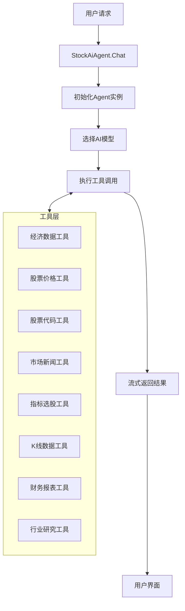
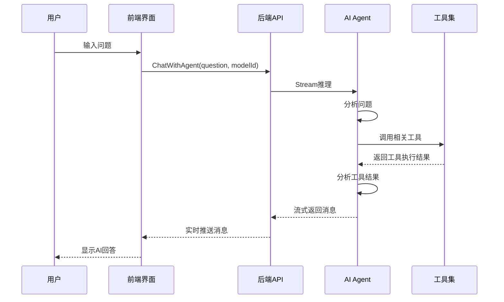

# Go-Stock Agent 功能技术文档

## 1. 功能概述

Go-Stock Agent 是一个基于 AI 的智能股票分析助手，能够：

- 回答用户关于股票市场、个股、行业的各种问题
- 自动调用专业工具获取实时数据进行分析
- 提供个性化的投资建议和市场洞察
- 支持多模型配置和流式响应

## 2. 核心架构

### 2.1 后端架构



### 2.2 前端架构

- 基于 Vue 3 + TypeScript + TDesign 组件库
- 实时流式消息展示
- 模型选择和系统提示词配置
- 响应式布局设计

## 3. 核心实现

### 3.1 Agent 初始化流程

**文件：** `backend/agent/agent.go`

```go
func GetStockAiAgent(ctx *context.Context, aiConfig data.AIConfig) *react.Agent {
    // 1. 根据配置选择AI模型
    // 2. 初始化模型客户端
    // 3. 注册工具集
    // 4. 创建并返回Agent实例
}
```

**流程说明：**
1. 根据 `BaseUrl` 判断使用哪个AI模型提供商
2. 配置模型参数（温度、最大token等）
3. 初始化对应模型的客户端
4. 注册所有可用工具
5. 创建 react.Agent 实例并返回

### 3.2 API 接口实现

**文件：** `backend/agent/agent_api.go`

```go
func (receiver StockAiAgent) Chat(question string, aiConfigId int, sysPromptId *int) chan *schema.Message {
    // 1. 创建消息通道
    // 2. 初始化StockAiAgent实例
    // 3. 设置系统提示词
    // 4. 执行流式推理
    // 5. 返回消息通道
}
```

**流程说明：**
1. 创建容量为512的消息通道
2. 根据配置ID获取AI配置
3. 初始化StockAiAgent实例
4. 设置默认或自定义系统提示词
5. 在goroutine中执行流式推理
6. 实时将结果写入通道并返回

### 3.3 工具实现

**文件：** `backend/agent/tools/` 目录下的各个工具文件

**工具列表：**

| 工具名称 | 功能描述 | 参数说明 |
|---------|---------|----------|
| QueryEconomicData | 查询经济数据 | 数据类型、时间范围 |
| QueryStockPriceInfo | 批量获取实时股价 | 股票代码列表 |
| QueryStockCodeInfo | 查询股票基本信息 | 股票代码 |
| QueryMarketNews | 获取市场新闻 | 新闻类型、数量 |
| ChoiceStockByIndicators | 指标选股 | 指标条件、数量 |
| StockKLineTool | 获取股票K线数据 | 股票代码、周期、范围 |
| InteractiveAnswerDataTool | 交互式问答 | 问题内容 |
| FinancialReportTool | 获取财务报表 | 股票代码、报表类型 |
| QueryStockNews | 获取个股新闻 | 股票代码、数量 |
| IndustryResearchReportTool | 获取行业研究报告 | 行业名称、数量 |
| QueryBKDictTool | 百度词典查询 | 词汇 |

**工具实现模板：**

```go
func GetXXXTool() tool.InvokableTool {
    return &ToolXXX{}
}

type ToolXXX struct{}

func (t ToolXXX) Info(ctx context.Context) (*schema.ToolInfo, error) {
    // 返回工具信息，包括名称、描述、参数定义
}

func (t ToolXXX) InvokableRun(ctx context.Context, argumentsInJSON string, opts ...tool.Option) (string, error) {
    // 1. 解析参数
    // 2. 执行具体逻辑
    // 3. 返回结果
}
```

## 4. 前端实现

**文件：** `frontend/src/components/agent-chat.vue`

### 4.1 界面结构

- 聊天消息区域：展示用户和AI的对话
- 输入区域：包含消息输入框和发送按钮
- 模型选择：下拉菜单选择AI模型
- 系统提示词：可配置AI角色

### 4.2 核心交互逻辑

```typescript
const inputEnter = function () {
    // 1. 验证输入
    // 2. 添加用户消息到聊天列表
    // 3. 显示AI思考状态
    // 4. 调用后端ChatWithAgent方法
    // 5. 处理流式返回结果
};

EventsOn("agent-message", (data) => {
    // 1. 处理AI返回的消息
    // 2. 更新聊天界面
    // 3. 处理工具调用信息
});
```

## 5. 工作流程

### 5.1 典型交互流程

1. **用户输入问题**：如"分析一下贵州茅台的最新财务状况"
2. **前端处理**：调用 `ChatWithAgent` 方法，传递问题和模型配置
3. **后端处理**：
   - 初始化Agent实例
   - 设置系统提示词
   - 执行流式推理
   - Agent根据问题选择合适的工具
   - 调用工具获取数据
   - 分析数据并生成回答
4. **结果返回**：流式返回结果到前端
5. **前端展示**：实时更新聊天界面，显示AI思考过程和最终答案

### 5.2 工具调用流程



## 6. 技术特点

### 6.1 多模型支持

- **阿里云 ARK**：适用于国内用户，响应速度快
- **DeepSeek**：专业中文模型，理解能力强
- **OpenAI**：通用能力强，支持最新模型

### 6.2 工具增强

- **实时数据**：通过工具获取最新市场数据
- **专业分析**：集成多种金融分析工具
- **智能选择**：Agent自动选择合适的工具

### 6.3 用户体验

- **流式响应**：实时显示AI思考过程
- **多轮对话**：支持连续问答
- **个性化配置**：可自定义模型和提示词

### 6.4 系统集成

- **与主应用无缝集成**：作为Go-Stock的核心功能之一
- **配置化管理**：通过设置界面管理AI配置
- **日志记录**：详细的操作和错误日志

## 7. 配置与部署

### 7.1 AI模型配置

在应用设置中配置AI模型：

- **Base URL**：模型API地址
- **Model Name**：模型名称
- **API Key**：访问密钥
- **Temperature**：生成温度
- **Max Tokens**：最大token数
- **Timeout**：超时时间

### 7.2 系统提示词配置

可自定义系统提示词，调整AI的角色定位：

- 默认提示词："你现在扮演一位拥有20年实战经验的顶级股票投资大师..."
- 可根据需要创建和管理多个提示词模板

## 8. 示例使用场景

### 8.1 市场分析

**用户问题：** "最近A股市场走势如何？"

**Agent处理：**
1. 调用市场新闻工具获取最新市场动态
2. 调用经济数据工具获取宏观经济指标
3. 分析数据并生成市场走势分析

### 8.2 个股研究

**用户问题：** "贵州茅台的最新财务状况如何？"

**Agent处理：**
1. 调用股票价格工具获取实时股价
2. 调用财务报表工具获取最新财报
3. 分析财务数据并生成研究报告

### 8.3 行业分析

**用户问题：** "新能源汽车行业未来发展趋势"

**Agent处理：**
1. 调用行业研究报告工具获取行业报告
2. 调用市场新闻工具获取行业动态
3. 分析数据并预测行业发展趋势

### 8.4 投资建议

**用户问题：** "基于当前市场环境，推荐哪些股票？"

**Agent处理：**
1. 调用指标选股工具筛选股票
2. 分析筛选结果
3. 生成个性化投资建议

## 9. 代码优化建议

### 9.1 性能优化

1. **工具执行并行化**：多个工具可并行执行，减少响应时间
2. **缓存机制**：对频繁查询的数据实现缓存
3. **模型参数调优**：根据不同场景调整模型参数

### 9.2 功能增强

1. **更多工具集成**：增加更多专业金融分析工具
2. **多语言支持**：扩展支持英文等其他语言
3. **个性化学习**：根据用户历史交互优化回答

### 9.3 可靠性提升

1. **错误处理增强**：更全面的错误捕获和处理
2. **重试机制**：网络错误时的自动重试
3. **监控告警**：对Agent性能和错误率进行监控

## 10. 总结

Go-Stock Agent 是一个功能强大的智能股票分析助手，通过整合先进的AI技术和专业的金融工具，为用户提供了一个全新的投资决策支持系统。它不仅能够回答用户的各种问题，还能主动获取实时数据进行分析，提供个性化的投资建议。

随着AI技术的不断发展和金融工具的持续丰富，Go-Stock Agent 有望成为投资者的得力助手，帮助用户在复杂多变的股票市场中做出更明智的决策。